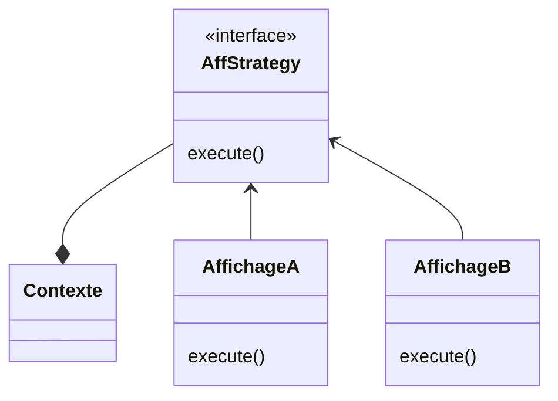

# Stratégie affichage

[Site de ref de design patern](https://refactoring.guru/fr)

```mermaid
classDiagram


AffStrategy --* Contexte
<<interface>> AffStrategy

class AffStrategy{
    execute()
}

class AffichageA{
    execute()
}

class AffichageB{
    execute()
}

AffStrategy <-- AffichageA
AffStrategy <-- AffichageB

```